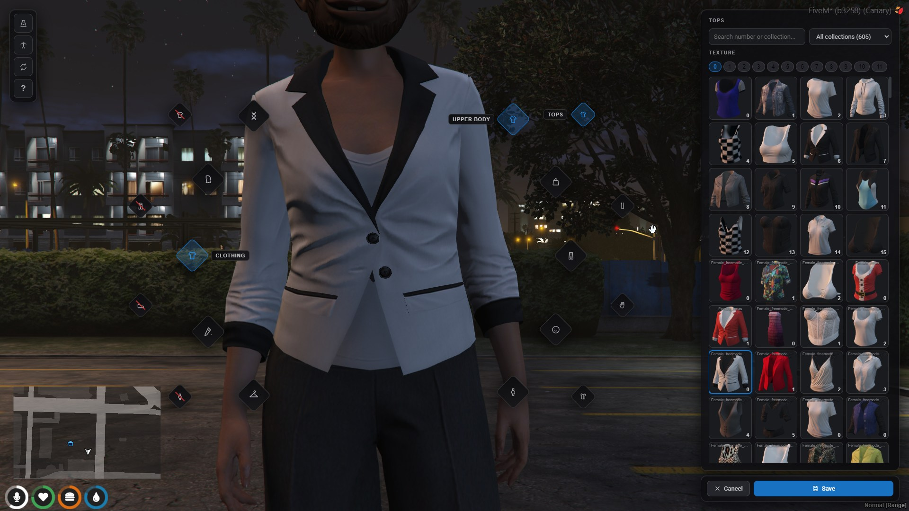
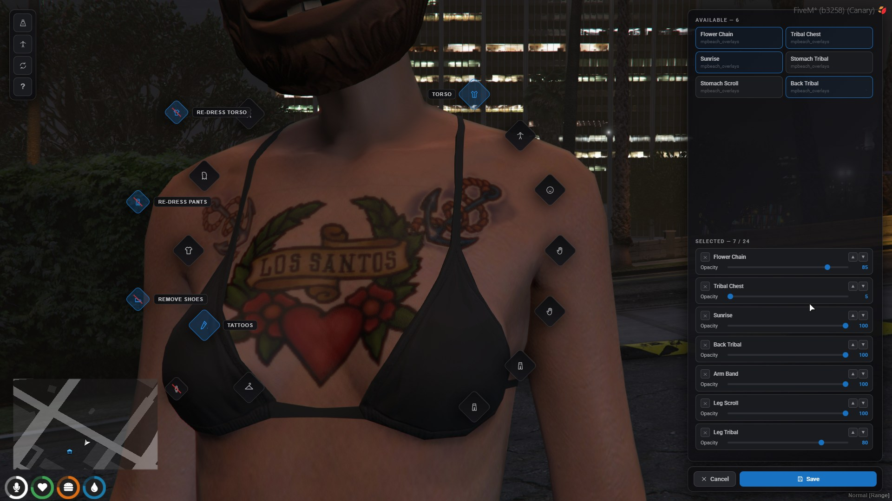
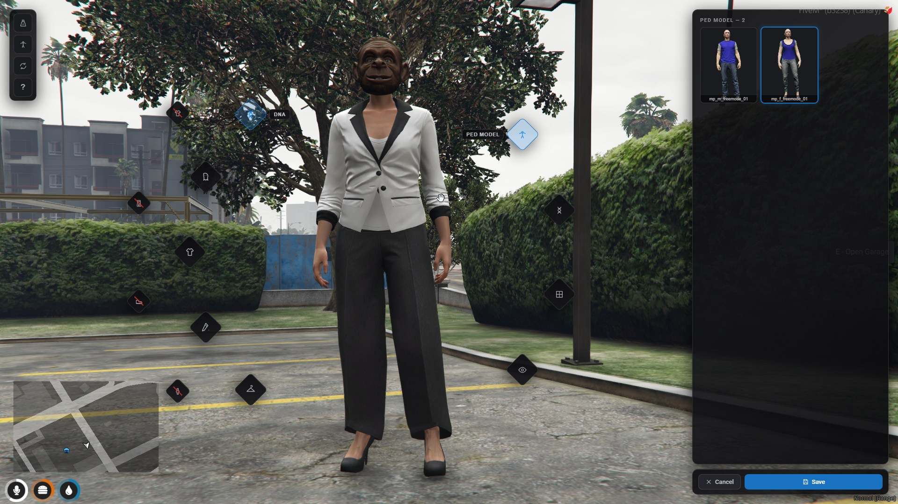

# qbx_appearance

Appearance system for Qbox. Built as a full replacement for
illenium-appearance, with a compatibility layer so existing resources keep
working while you migrate.

The core difference from every other appearance script: drawables and props
are stored as `{ collection, local index }` pairs through the FiveM collection
natives instead of global indexes. Global indexes shift every time a title
update lands or you reorder clothing packs — collection pairs don't. Saved
outfits survive game updates; only a genuinely removed drawable falls back
(logged and skipped, never a crash).

https://github.com/Epixx1337/qbx_appearance/blob/main/docs/media/demo-1.mp4

## What's in the box

**The editor.** One Svelte NUI for character creation, clothing stores,
barbers, tattoo shops, the surgeon, lockers and the admin `/pedmenu`. Category
diamonds float around your character, the camera orbits and zooms toward the
body part under your cursor, and every drawable shows as a real screenshot of
that item. Heritage, skin tone and eye color are picked from image grids;
face features are shaped on drag-pads instead of 40 sliders.

**The screenshot studio.** Generates all of those thumbnails in-game:
2,600+ clothing items, heritage faces, skin tones, eyes and ped portraits.
Batch runs resume where they stopped, framing is tunable per category or per
DLC pack, and a difference-matte pipeline produces exact alpha — transparent
visors and backdrop-colored clothes come out clean. New pack added? One
button shoots just that DLC for both genders.

**Tattoos** with the full 840-entry base game catalogue, stacking, layer
ordering and per-tattoo opacity for sleeve builds.

**Outfits** that always save your full look, with per-row actions to wear
just the clothing or just the hair & tattoos. Job and gang presets are created
in-game by bosses with a minimum grade and gender. Outfits can be shared —
as a physical `outfit_bag` item, or offered to nearby players who accept
through a dialog.

**Items.** A clothing bag that kneels you over an animated duffel to change
outfits, and `/pants`-style commands that strip worn pieces into real
ox_inventory items with the piece's screenshot as the inventory image.

**Ped support.** 1,000+ human peds and the animal set behind config toggles,
whitelist/blacklist, per-player grants by any identifier, and portraits for
the model picker.

More demo footage: [docs/media/demo-2.mp4](docs/media/demo-2.mp4)

## Requirements

- qbx_core, ox_lib, oxmysql, ox_inventory
- [screencapture](https://github.com/pushkarydv/screencapture) (studio only)

## Installation

1. Import `sql/install.sql`.
2. Add the items from `docs/items.md` to `ox_inventory/data/items.lua`.
3. `ensure qbx_appearance` after `qbx_core`, `ox_lib`, `oxmysql`,
   `ox_inventory`, `screencapture`.
4. Grant the studio ace: `add_ace group.admin qbx_appearance.studio allow`.
5. Generate thumbnails on a dev client: `/screenshotclothing`,
   `/screenshotfaces`, `/screenshotpeds`, then restart the resource. See
   [docs/studio.md](docs/studio.md) — including the one client convar the
   studio needs for headless clothing shots.
6. Coming from illenium-appearance or qb-clothing? Follow
   [docs/migration.md](docs/migration.md).

The NUI ships prebuilt in `web/build`. Rebuild with `cd web && bun i && bun run build`.

## Documentation

| doc | covers |
| --- | --- |
| [docs/config.md](docs/config.md) | every config option |
| [docs/editor.md](docs/editor.md) | the editor UI, camera, undress toggles, sections |
| [docs/studio.md](docs/studio.md) | screenshot studio commands, framing presets, capture pipeline |
| [docs/outfits.md](docs/outfits.md) | outfits, job/gang presets, sharing, bag & clothing items |
| [docs/migration.md](docs/migration.md) | moving off illenium-appearance / qb-clothing, with the qbx_core patches |
| [docs/cdn.md](docs/cdn.md) | serving thumbnails from a CDN instead of the resource download |
| [docs/events.md](docs/events.md) | events, exports, commands, compatibility surface |
| [docs/items.md](docs/items.md) | ox_inventory item definitions |
| [docs/schema.md](docs/schema.md) | database schema |
| [docs/conflicts.md](docs/conflicts.md) | known conflicts (qbx_radialmenu clothing commands) |
| [docs/internals.md](docs/internals.md) | engine constraints the implementation works around |

## Commands

Player: `/reloadskin`, plus the physical clothing commands (`/hat`, `/mask`,
`/shirt`, `/pants`, ...) when enabled.

Admin: `/pedmenu [scope] [id]`, `/appearancezone`,
`/convertappearance illenium|qb-clothing`, and the `/screenshot*` family
(removable entirely with `studioCommands = false`).
