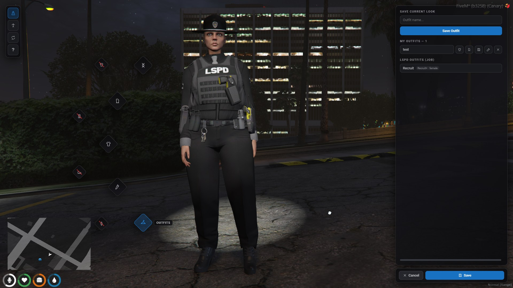
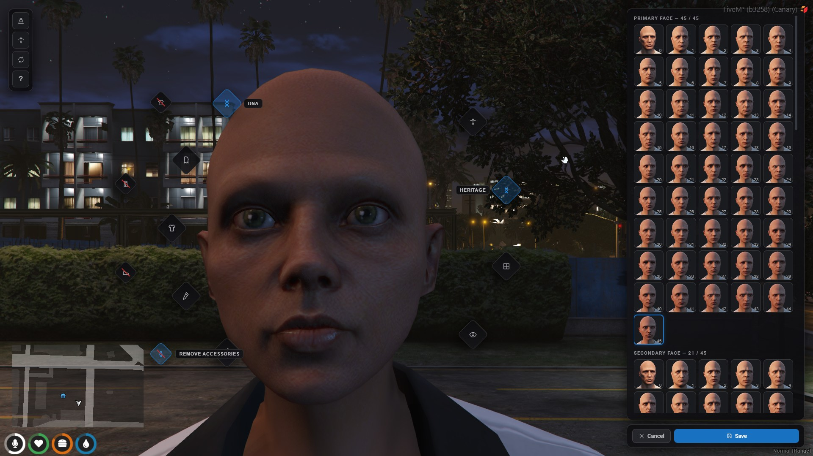
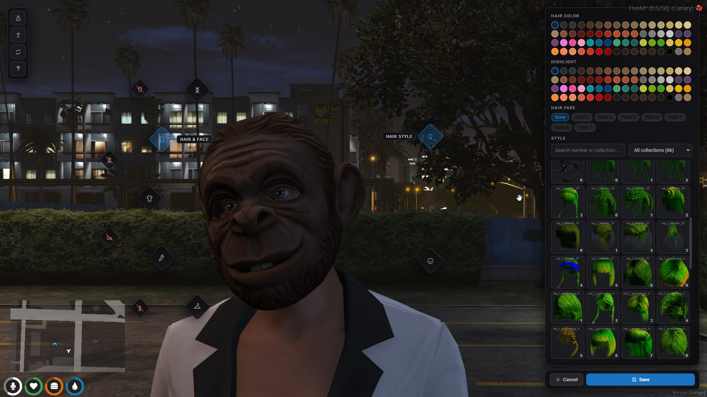
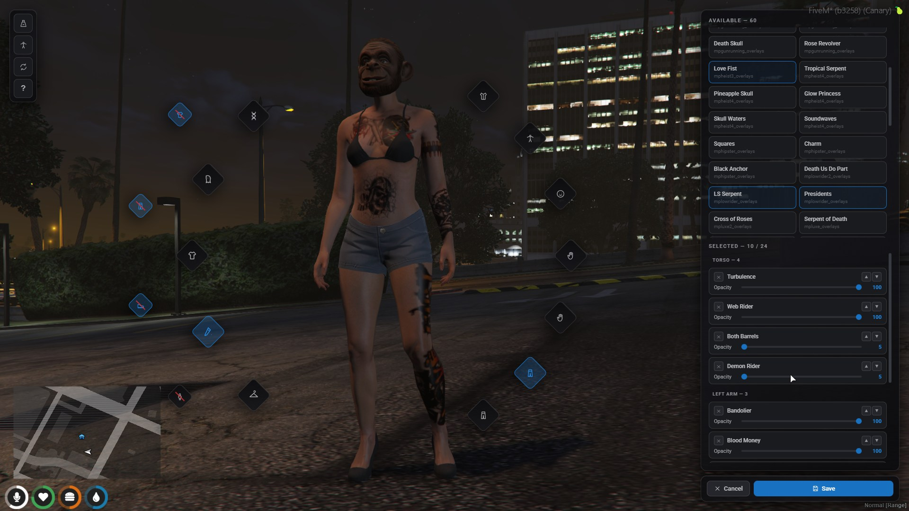

# The editor

One editor serves every flow — character creation, clothing stores, barbers,
tattoo shops, the surgeon, lockers and the admin `/pedmenu`. What differs per
flow is which sections are unlocked (`shopSections` in `config/client.lua`).

## Layout

- **Diamond badges around the character.** Left side: main categories (DNA,
  Hair & Face, Clothing, Tattoos, Outfits) plus the red-struck undress
  shortcuts on the outer arc. Right side: subcategories of the current
  selection (clothing groups, tattoo zones), with leaf slots on the outer arc.
  Tooltips appear on hover; the active badge is highlighted.
- **Right panel**: the browser for whatever is selected, with Cancel/Save
  attached below.
- **Top-left tools**: Spotlight (lights the character), Pose (cycles preview
  poses to check clipping), Flip side (jump to the opposite side for ears,
  back tattoos), Help.

## Camera

- **Right-drag** orbits around the character.
- **Left-drag up/down** moves the view along the body.
- **Scroll** zooms toward whatever bone the cursor is over — pointing at the
  feet and zooming lands on the shoes, pointing at the head lands on the face.
- Selecting a category or tattoo zone flies the camera to a matching preset
  and turns the character so the zone faces the camera.

## Undress shortcuts

The struck-through badges strip a region (torso, pants, shoes, accessories) to
try items on bare skin. They are toggles — clicking again re-equips exactly
what was worn — and purely a preview aid: **Save re-equips everything first**,
so a stripped state can never be saved or leave the editor.

## Sections

### DNA

Heritage picks the two parent faces from image grids (46 rendered heads) with
blend sliders; skin tone and eye color use rendered swatch grids as well. Face
features are shaped on drag-pads instead of sliders — drag horizontally and
vertically to set two features at once.

### Ped models

Visible when the ped policy allows more than the freemode models (or the
player has a `pedAccess` grant). Portraits come from `/screenshotpeds`.

### Hair & Face

Hair styles as rendered thumbnails with color, highlight and fade selection
(fades are decorations layered under the hair), plus every head overlay —
eyebrows, beards, blemishes, makeup, aging — with their color options.

### Clothing

Slots are grouped (upper body, lower, head, accessories, wrists), each showing
a virtualized grid of rendered thumbnails. The search box filters by number or
collection; the collection dropdown filters to one DLC and **stays selected
across slots**, so a whole outfit can be assembled from a single pack. Texture
variants appear as chips when the selected drawable has more than one.

Admins with studio access can right-click any tile to re-shoot its screenshot
on the spot.

### Tattoos

Zones follow the badges (torso, head, arms, legs). Hovering an entry previews
it; clicking toggles it on or off. Worn tattoos are grouped by body zone —
each group header jumps the camera to that zone — and every tattoo has an
opacity slider plus layer ordering within its zone, so stacked pieces build
sleeve effects.

### Outfits

See `docs/outfits.md`.

## Saving

Save persists the appearance, charges the shop price when opened through a
paid store, and mirrors the qbx_core save flow. Cancel restores the exact
pre-editor look including model, tattoos and hair fade. `/reloadskin` rebuilds
the ped from scratch from the saved appearance (dead or downed players are
refused, and health/armour are preserved so it cannot be abused as a heal).
