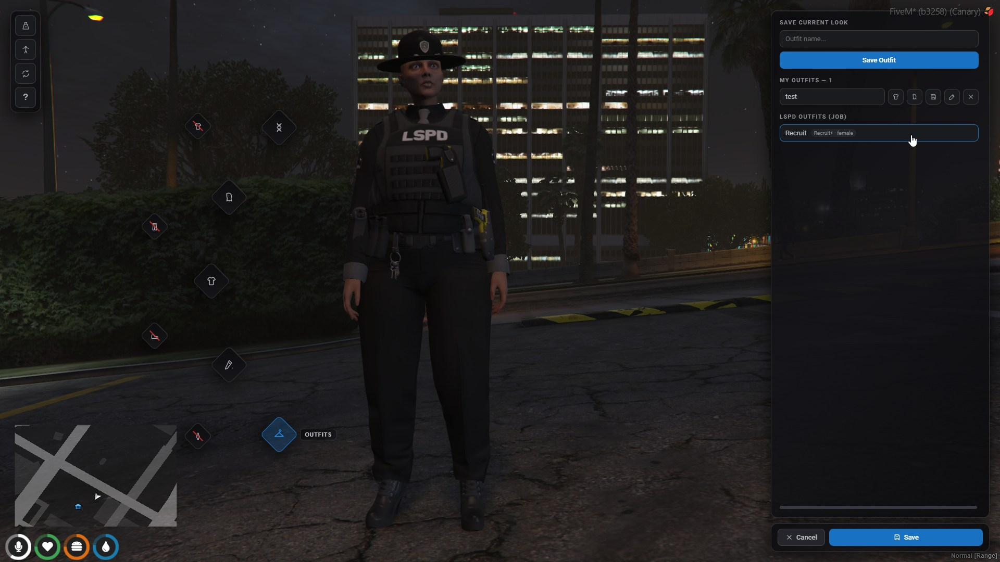

# Outfits

## Personal outfits

Saving always stores the **full look** (model, clothing, hair, overlays,
tattoos). Each saved outfit row offers, as icon buttons with tooltips:

- **name** — wear the full outfit
- **shirt icon** — wear its clothing only, keeping your hair/tattoos
- **hair icon** — wear its hair & tattoos only, keeping your clothing
- **disk** — overwrite the outfit with your current look
- **pen** — rename
- **✕** — delete

Limits come from `outfits.maxSaved`. Outfits store collection pairs, so they
survive game updates that shift drawable ids.

## Job & gang outfits

Bosses see a create form under their group's section: name, minimum grade and
gender. Presets store clothing only (applying one keeps the wearer's face and
hair), the grade requirement shows with the grade's actual label ("Recruit+"),
and members only see presets matching their body type — bosses see everything
so they can manage both.

Lockers can be placed as zones (`job_locker` / `gang_locker` via
`/appearancezone` or `config/client.lua`) and open the outfits view for
members of that group and grade.

## Sharing outfits

Every personal outfit row has a **share** button. Behavior depends on
`physicalItems.enabled`:

**Item mode** (enabled): sharing hands you an `outfit_bag` item carrying the
entire outfit in metadata, labeled with the outfit's name and packed-by
character name. Give it to anyone: using it plays the kneel scene, equips the
exact outfit and consumes the bag. Cross-body-type bags refuse to equip. The
receiver saves it as their own outfit through the normal save form if they
want to keep it.

**Nearby mode** (disabled): sharing lists players within 5 meters by
**character name**. The chosen player gets an accept/decline dialog —
*Accept the outfit "X" from Firstname Lastname?* — and on accept the outfit is
added to their saved outfits under the same name (suffixed `(2)`, `(3)`, ...
when taken). Offers expire after 60 seconds; distance and ownership are
validated server-side.

## The clothing bag item

`clothing_bag` is a carryable wardrobe: using it plays a synchronized kneel
scene over an opened duffel and shows the outfit picker (`clothingBag.menu`:
NUI overlay or ox_lib context menu). Picking an outfit applies it on the spot.
Bags have a configurable cooldown and a limited number of uses (`0` =
unlimited); the counter lives in the item's metadata and the bag disappears on
its last use.

## Physical clothing items

With `physicalItems.enabled`, each configured slot gets a chat command —
`/hat`, `/glasses`, `/earring`, `/watch`, `/bracelet`, `/mask`, `/shirt`,
`/pants`, `/shoes`, `/bag`. Running one plays the slot's undress animation,
swaps the slot to its naked default and puts a `clothing_item` in the
inventory. The item's metadata carries the exact collection pair, a label like
`Pants #4 (Female)` and the piece's screenshot as its inventory image. Using
the item plays the dress animation and re-equips it — on the matching body
type only.

The flow is atomic: the item is only created once the strip actually applied,
and clothing is restored if the inventory refuses the item — so pieces can
never duplicate.
