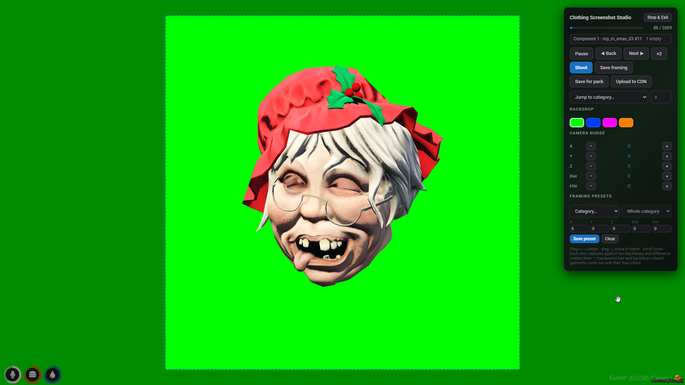
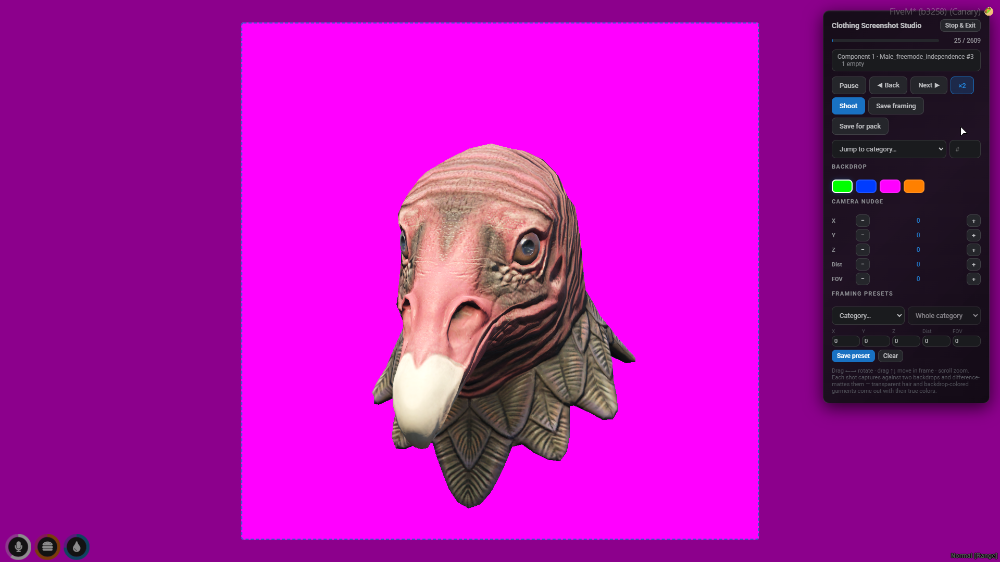

# Screenshot studio

The studio generates every thumbnail the UI uses: clothing and props, heritage
faces, skin tones, eye colors and ped portraits. It runs entirely in-game on a
spawned mannequin — the player is hidden, made invincible and restored
untouched afterwards.

## Commands

All commands are admin-restricted (`studioGroup`) and can be removed entirely
with `studioCommands = false`.

| command | what it does |
| --- | --- |
| `/screenshotclothing [male\|female\|both\|current] [overwrite]` | Batch-shoot every clothing item and prop. Skips files already on disk so interrupted runs resume; `overwrite` redoes everything. |
| `/screenshotstudio` | Manual mode: starts paused with full control per shot. |
| `/screenshotmissing [target]` | Re-shoots files still missing on disk on a dressed body with the head visible — fills the "none" entries (no mask, no vest, ...) with a meaningful picture. |
| `/screenshotfaces [all\|faces\|skins\|eyes]` | Character-creator thumbnails: 46 heritage heads, 46 skin tones per gender, 32 eye colors. |
| `/screenshotpeds [overwrite]` | Full-body ped portraits for the model picker. |
| `/screenshotfailed` | Re-opens every item that failed in previous runs, one by one in manual mode. |

Output lands in `screenshots/` (one folder per slot under `clothing/`, plus
`faces/` and `peds/`), named `<model>_<collection>_<drawable>.webp`. The NUI
reads them after a resource restart, or from the CDN (`docs/cdn.md`).

## The studio panel

- **Pause / Resume / Back / Next / jump-to-category** — navigate the work list.
- **×2** — halves the settle waits for faster batches.
- **Shoot** — re-shoot the current item with the current framing and backdrop.
- **Drag ←→** rotates the mannequin, **drag ↑↓** moves it in frame, **scroll**
  zooms. The dashed square is the photo frame: only what is inside it is kept.
- **Backdrop swatches** — pick the primary backdrop color for items that blend
  into it (a green garment against green: switch to magenta).
- **Camera nudge** — fine X/Y/Z/distance/FOV offsets for the current item.
- **Save framing** — folds the current nudge into a persistent preset for the
  item's category; **Save for pack** saves it for the item's collection only
  (overrides the category preset — made for custom packs that sit differently).
- **Framing presets** — browse and edit every saved preset by category or
  collection without navigating to an item. Presets apply automatically in
  every future batch run.
- **Male / Female** — swap the mannequin mid-session (manual mode).
- **Shoot ⟨category⟩** — auto-shoots the selected category for the current
  model, then the other one, and returns to manual browsing.
- **Shoot a DLC…** — shoots every item of one collection across all categories
  for both models. Collection names are gender-mapped automatically
  (`mp_m_2024_01` ↔ `mp_f_2024_01`). This is the tool for newly added packs.
- **Upload to CDN** — appears when a provider is configured with manual
  uploads; offers "missing only" or "replace all" (`docs/cdn.md`).

## How a shot works

1. The item is applied to the mannequin through the collection natives, with
   its streaming preload awaited. Every other slot is hidden.
2. The scene is deterministic: frozen clock, fixed weather, zero wind, a key
   spotlight plus fill light, and a statue-still mannequin (ambient animations,
   base idle and blinking disabled).
3. Two captures are taken of the identical frame against two backdrop colors
   (green/magenta or blue/orange). A difference matte solves the exact alpha
   and unblended color per pixel — transparent visors, tinted hair and
   backdrop-colored garments come out with true colors and soft edges.
4. The processor then removes stray isolated blobs (engine placeholder
   meshes), auto-crops to the visible content with padding, detects clipping
   (auto zoom-out and re-shoot), and encodes a webp within the transport
   budget.
5. The finished file — never a raw capture — is sent to the server and written
   to `screenshots/`.

Two capture variants exist: posed items (watches/bracelets with a raised-wrist
pose) use a single chroma-keyed capture, since a playing animation would differ
between two captures; eye close-ups are saved opaque exactly as framed, since
there is no backdrop inside the frame to matte against.

Failures are tracked per item with the reason, reported in the panel and the
console, and `/screenshotfailed` re-shoots them manually. "Empty" counts are
placeholder "none" drawables that render nothing — expected, not failures
(`/screenshotmissing` gives them body-context images instead).

## Hiding the head: `allowEmptyHeadDrawable`

Clothing shots hide the mannequin's head. That needs the **client-side**
convar `allowEmptyHeadDrawable true` on the machine running the studio —
`setr` in server.cfg does **not** work. Either type it in the F8 console each
game session, or add `+set allowEmptyHeadDrawable true` to
`%localappdata%\FiveM\FiveM.app\commandline.txt` once. The studio probes it on
every open and shows a warning banner while it is off; shots still work, the
head just stays visible.
